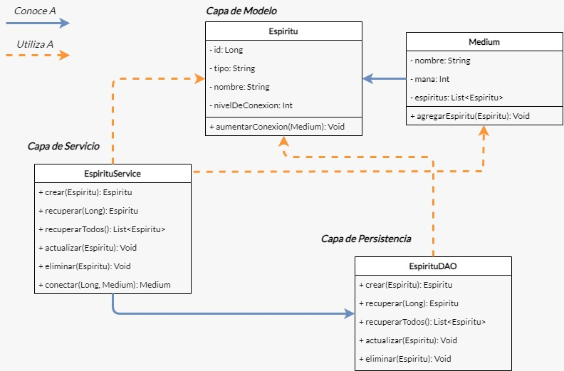

# TP 1 - JDBC

Tras días recomponiéndonos de aquella vivencia paranormal, los seis informáticos nos planteamos varias preguntas durante charlas reflexivas, que por momentos adquirían tintes filosóficos.

> _¿Qué o quiénes eran esos seres?_
> 
> _¿Son hostiles? ¿Bondadosos?_
> 
> _¿Qué condición se cumplió en ese ritual para vislumbrarlos momentáneamente y conectarnos con ellos?_ 

Preguntas y teorías inundaron nuestra conversación indiscriminadamente, en un intento por revelar alguna verdad sobre estos especímenes, hasta que uno de los seis entonó una pregunta que resonó en todos.

> _¿Rehacemos el ritual? Capaz así podamos tener alguna respuesta_

Tras un breve silencio compartido, todos asentimos al unísono antes de buscar los materiales utilizados para el ritual.

Sal, velas e incienso invadieron el suelo, las paredes y las superficies del ahora oscuro cuarto. La atmósfera del ceremonial espacio comenzó a volverse más pesada y asfixiante con cada vela encendida, hasta que, individualmente, cada uno de nosotros—unos novatos ritualistas—caímos inconscientes, para luego despertar en un bosque con tintes arcanos en su pintoresca belleza.

Tras un intento de comprender el entorno a nuestro alrededor, un par de aullidos agudos resonaron en el bosque junto con el inconfundible sonido del agua cayendo. Unos metros detrás de nuestro grupo, los vimos: dos zorros a las orillas de un estrecho caudal de agua. Uno de ellos se parecía a un zorro común y corriente, pero el otro no era un zorro como los que conocíamos.

Su pelaje púrpura no hacía más que resaltar la naturaleza desconocida de este supuesto cánido de ojos rojizos, que instintivamente miró en nuestra dirección antes de desvanecerse.

  

Tras la huida del espíritu, todos recuperamos la consciencia y tomamos la decisión de reflexionar sobre qué características podrían tener estos entes antes de intentar otra conexión con ellos.

---
### Requerimientos

Tras un breve debate, decidimos tener un módulo que nos permita identificar los distintos tipos de espíritus provenientes de aquel mundo desconocido, junto con sus diversas características:
- Su tipo.
- Su nivel de conexión, que sabemos que por defecto es 0 y puede llegar **hasta** 100.
- Su nombre.

También sabemos que los espíritus pueden aumentar su nivel de conexión al momento en que conectan con un médium, es decir, con un ritualista como nosotros.

Resumiendo el planeamiento, llegamos a la siguiente interfaz:

  

La interfaz `EspirituDAO` declara los siguientes métodos que nosotros debemos implementar:

- `Espiritu crear(Espiritu espiritu)` - Recibe un objeto `Espiritu` y se encarga de persistirlo en la base de datos. Devuelve el mismo objeto pero con el id asignado.

- `Espiritu recuperar(Long idDelEspiritu)` - Este método devolverá al espíritu cuyo id sea igual al provisto por parámetro. Se espera que este método devuelva, a lo sumo, un solo resultado.

- `List<Espiritu> recuperarTodos()` - Este método deberá devolver una lista de todos los espíritus existentes, ordenados alfabéticamente por su nombre en forma ascendente.

- `void actualizar(Espiritu espiritu)` - Actualiza el espíritu recibido por parámetro.

- `void eliminar(Long idDelEspiritu)` - Debe eliminar de la base de datos al espíritu cuyo id sea igual al provisto por parámetro. De no existir, no hace nada.

El equipo de front estará utilizando la interfaz `EspirituService` para comunicarse con nuestro equipo. Este servicio deberá implementar los métodos que utilizarán al DAO, sumado al siguiente método:

- `Medium conectar(Long espirituId, Medium medium)` - Deberá lograr que el espíritu y el médium queden conectados. Esto implica que el espíritu quede agregado en la lista de espíritus que el médium conoce, además de fortalecer su nivel de conexión en 10 unidades. Por el momento no nos interesa persistir a los médiums, pero sí hay que registrar el aumento del nivel de conexión del espíritu.

---
### Se pide:
- Que provean implementaciones para las interfaces descritas anteriormente, haciendo uso de todo lo visto en clase.
- Asignen propiamente las responsabilidades a todos los objetos intervinientes, discriminando entre servicios, DAOs y objetos de negocio.
- Creen tests que prueben todas las funcionalidades pedidas, con casos favorables y desfavorables.
- Provean un archivo .sql con las sentencias DDL que sean necesarias para crear el schema de la base de datos (create tables).
