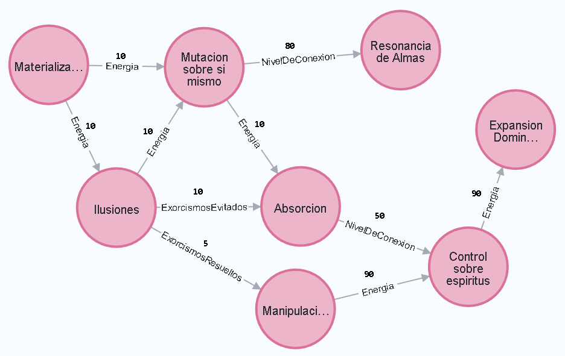

# TP 4 - NoSQL - Neo4J

Finalmente, tras interminables búsquedas en foros silenciosos, abandonados u ocultos, y después de tantas huidas desesperadas, RDJ nos encontró antes de que nosotros pudiéramos dar con él, casi como si una fuerza divina —o quizás algo más oscuro— hubiera intervenido en nuestro destino.

Fue durante una noche de tormenta intensa. Nos habíamos refugiado en el viejo Santuario frances "Da Cope", un lugar aislado en las afueras de la ciudad. Según nuestras investigaciones, allí residían varios ángeles que podrían protegernos de aquellos a quienes empezamos a llamar "los poseídos", hombres conectados con demonios y despojados de su humanidad. 

Estos poseidos sembraban el caos por la ciudad destruyendo todo a su paso, creando más poseídos de manera forzosa, corrompiendo almas inocentes y asesinando o torturando a quienes se resistíeran. Gracias a ellos las calles se habían transformado en un auténtico infierno, una manifestación terrenal de la condenación eterna. 

La noche profundizaba su cernir sobre nosotros y el viento arremetía con tal intensidad que temíamos que el santuario pudiera derrumbarse. En esos momentos nosostros sabiamos que permanecer dentro era nuestra mejor opción, no por miedo a la tempestad, sino porque sabíamos que, si no continuábamos trabajando, no podríamos detener la locura que nosotros mismos habíamos desencadenado. El tiempo era nuestro enemigo; los poseídos se multiplicaban sin cesar, y cada segundo perdido nos acercaba más a nuestra perdición y a la de todos.

Ya entrada la media noche, tras testear una simulación finalmente fallida en la que habiamos estado trabajando durante horas, las puertas del santuario se abrieron de golpe, dejando entrar de manera violenta el viento de la tormenta, volcando todo y apagando las luces. La oscuridad nos envolvió, rota únicamente por el pálido brillo de la luna que se filtraba a través de las puertas abiertas.

En esa tenue iluminación, distinguimos una silueta humanoide avanzando por el pasillo de entrada. Pero no caminaba; flotaba en el aire. Jamás habíamos visto algo así, y apenas tuvimos tiempo de asimilarlo antes de que todo a nuestro alrededor comenzara a levitar y a arder en llamas. Este poseído mostraba poderes que superaban cualquier cosa que hubiéramos visto antes.

El terror por nuestras vidas y la posibilidad de que todo hubiera sido en vano nos paralizó. Pero entonces, de repente, todo... se detuvo. Las llamas se extinguieron como si nunca hubieran existido, los objetos flotantes cayeron estrepitosamente al suelo, y el poseído se desplomó de rodillas frente a nosotros.

Una figura extraña emergió detrás de él, empapada como si hubiera surgido de las entrañas de la tormenta. Se acercó al poseído con una calma inquietante, posó sus dedos sobre su frente, y en un instante, el poseído cayó al suelo, inmóvil, incapacitado, exorcizado.

La figura nos miró entonces, sus ojos profundos y antiguos como abismos, y comenzó a caminar hacia nosotros. 

Un solo paso. 

Nuestros corazones se estremecieron. ¿Era salvación o condena lo que traía consigo? No lo sabíamos, pero de su ser emanaba una dualidad imposible: Una pureza angelical y una corrupción demoníaca que se entrelazaban en un torbellino de energías opuestas.

Dio un paso más.

Detrás de él, una sombra danzaba, girando como un remolino de humo oscuro, adquiriendo formas grotescas y retorcidas, una silueta que mutaba con cada latido, volviéndose cada vez más monstruosa, más tangible.

Otro paso.

El aire se volvió espeso, pesado, y un sudor frío comenzó a formarse detrás de nuestras nucas. 

Otro paso.

Una sensación de opresión y temor forzó a más de uno a caer de rodillas al suelo, incapaces de soportar el peso de lo que se acercaba. La sombra que lo seguía ahora se contorsionaba en una forma demoníaca, afilada, retorcida, hambrienta.

Finalmente, la figura llegó lo suficientemente cerca como para que podamos distinguir sus rasgos. Era un muchacho. Estaba agotado, con los ojos cargados de una preocupación insondable, como si su misma existencia fuera una carga demasiado pesada. 

Mantuvo una distancia cautelosa, pero su presencia lo llenaba todo.

“Veran, yo soy RDJ.”

  

“Aunque no me comporte como tal, yo también soy un poseído, pero estoy aquí para ayudarlos a arreglar este apocalipsis.”

RDJ se veía como un muchacho joven, no muy distinto que cualquiera si se ignoraba su antebrazo, o mejor dicho, la ausencia de él. Su extremidad había sido brutalmente arrancada, dejando un muñón grotesco que aún chorreaba sangre oscura. Cada paso que RDJ daba parecía dejar una huella de sangre detrás, como si la propia tierra estuviera marcada por su dolor y su lucha.

“Se que me buscaban, pero andar pendiente de las redes mientras me persiguen demonios es… complicado.” - les dice, forzando una sutil sonrisa - “No se preocupen más, todo esto tiene solución. Necesito que me acompañen a donde comenzó todo.”

Detrás de RDJ, el demonio observaba. Su figura oscura se contorsionaba en el aire como una sombra viva, imposible de definir con claridad, pero su único ojo, brillante y maligno lo veía todo. Una sonrisa torcida se dibujó en su rostro, sus colmillos reluciendo con una malevolencia palpable. Por más que RDJ les prometiera salvación, el demonio, en su risa cruel, nos recordaba que estabamos jugando un juego cuyo desenlace ya había sido escrito, y no a favor de nosotros.

## Habilidades

Los espiritus cada vez son mas poderosos, acabamos de descubrir que tambien pueden poseer habilidades las cuales, tienen nombre único entre todas, y pueden mutar en otras.

Para que una habilidad mute en otras, debe cumplir ciertas condiciones.

### Condición de mutación

Una condición de mutación se representará como una relación entre una habilidad y otra.

Después de cada intento de exorcismo, se deberá evaluar si alguna de las habilidades de los espiritus muta. Para ello, deberemos analizar bajo qué condición puede ocurrir esa mutación y si esa condición se cumple luego del intento de exorcismo.

Ejemplifiquemos:

Inky es un espiritu demoníaco y tiene la habilidad de "Hipervelocidad" que puede mutar en "Teletransportación" si se cumple la siguiente condición:

`8 (cantidad) Exorcismos evitados (evaluacion)`. 

Eso quiere decir que si luego de intentar ser exorcizado, Inky cuenta que lo evitó 8 veces en total, su habilidad de "Hipervelocidad" mutara y ahora Inky tambien poseera "Teletransportación".

Aqui ya vemos entonces cuales son las caracteristicas que forman a una condicion de mutacion.

- Cantidad: Cuál es la cantidad hasta la cual debe llegar la condición para cumplirse la mutación.
- Evaluacion: Condición que se está evaluando. Estas son: exorcismos resueltos, exorcismos evitados, cantidad de energía, o nivel de conexión.

  

### Casos borde y aclaraciones

- Que una habilidad de un espiritu mute no significa que la pierda. Siguiendo nuestro ejemplo, Inky sigue teniendo la habilidad "Hipervelocidad" aunque ahora tambien tenga "Teletransportación".
- Si se dan las condiciones para que una habilidad mute a más de una habilidad, lo hará.

Ejemplo: Un espiritu con "Mutacion sobre si mismo" puede cumplir para las condiciones de "Resonancia de Almas" y "Absorcion" al mismo tiempo luego de intentar exorcizar, si cumple con ambas condiciones, el espiritu ahora tendrá las dos habilidades.

- Un espiritu no puede mutar una habilidad a otra que ya posee.
- Las habilidades sólo mutan una vez por intento de exorcismo. (No puede suceder que una habilidad "salte" por cumplir condiciones de mutaciones consecutivas en el grafo)
- Las relaciones de mutación deben ser unidireccionales.

## Servicios

Se deberá implementar un nuevo servicio `HabilidadService` que implemente los siguientes métodos

- `Habilidad crear(Habilidad habilidad)` - Deberá persistir la habilidad recibida.

- `void descubrirHabilidad(String nombreHabilidadOrigen, String nombreHabilidadDestino, Condicion condicion)` - Crea una relación de mutación de una habilidad a otra con la condición dada.

- `void evolucionar(Long espirituId)` - El espiritu deberá mutar, obteniendo las habilidades que cumplen su condición de mutación. **Nota:** Solo muta a todas las que cumplen su condición que esten a un "salto" desde cada habilidad.

- `Set<Habilidad> habilidadesConectadas(String nombreHabilidad)` - Retorna todas las habilidades a las cuales puede mutar la habilidad dada.

- `Set<Habilidad> habilidadesPosibles(Long espirituId)` - Dado un espiritu, retorna la colección de habilidades a las cuales puede mutar que cumplen su condición de mutación.

- `List<Habilidad> caminoMasRentable(String nombreHabilidadOrigen, String nombreHabilidadDestino, Set<Evaluacion> evaluaciones)` - Dada una habilidad de la cual partir, y una a la que se quiere llegar, devuelve el camino de habilidades que menos saltos debe dar solo considerando las mutaciones que sean en base a las evaluaciones provistas. Casos borde a considerar:
  - Si las dos habilidades no están conectadas por ningún camino, se levanta la excepción `HabilidadesNoConectadasException`.
  - Si las habilidades están conectadas pero no hay ningún camino con el set de evaluaciones, se levanta la excepción `MutacionImposibleException`.

### Se pide:
- Implementar los requerimientos utilizando una base de datos orientada a grafos a su criterio.
- Creen un HabilidadController con los cuales el frontEnd pueda acceder a los metodos del HabilidadService.
- Creen test unitarios para cada unidad de código entregada que prueben todas las funcionalidades pedidas, con casos favorables y desfavorables.

## Bonus

### Eficiencia de mutación

Para poder analizar la capacidad de mutación de un espiritu, se deberá crear un mensaje `List<Habilidad> caminoMasMutable(Long espirituId, String nombreHabilidad)` que dado un espiritu y una habilidad (se asume adquirida por el espiritu), retorna el camino con la mayor cantidad de habilidades obtenibles a partir de la dada segun las condiciones que podría cumplir el espiritu.

Ejemplo: Inky cuenta con 20 de energía, 85 de nivel de conexión, y la habilidad "Mutacion sobre si mismo", caminoMasMutable con dichos datos debería retornar las habilidades "Absorcion" y "Control sobre espiritus".

### Deficiencia de mutación
Se pide implementar el método `List<Habilidad> caminoMenosMutable(String nombreHabilidad, Long espirituId)` que devuelve el camino de habilidades que menos mutaciones incluya, partiendo desde la habilidad dada y que sea posible dadas las condiciones del espíritu dado.

## Consideraciones:
El bonus no es necesario para aprobar, pero de ser implementado correctamente sumará nota. Una mala implementación NO restará nota, aún así, recuerden no invertir esfuerzos en el bonus a costa de la implementación principal del TP que es donde las correcciones si afectan la nota final.
